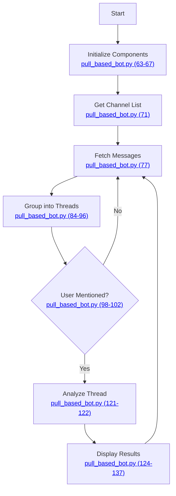

# Pull-Based Slack Bot Documentation

This document outlines the functionality of the pull-based Slack bot that analyzes threads and provides insights using LLM.

## Package Documentation
- [Slack Package](../slack/docs/slack_client.md): Core messaging and formatting functionality
- [LLM Package](../llm/docs/thread_analyzer.md): Thread analysis and action identification

## Overview

The bot periodically fetches and analyzes Slack threads where the user is mentioned, providing:
- Thread summaries using LLM analysis
- Action items and their requestors
- Thread statistics and activity metrics
- Optional detailed thread views

## Flow Diagram



## Implementation Details

This section provides details about each step in the flow diagram. Click the links in the nodes above to view the specific code implementations.

### Initialize Components
Sets up all required components:
- Creates Slack client for message fetching
- Creates message formatter for output
- Initializes LLM analyzer

### Get Channel List
Fetches the list of channels configured for monitoring, using channel whitelisting from the client implementation.

### Fetch Messages
Retrieves messages from each channel within the specified time window.

### Group into Threads
Organizes messages into their respective threads:
- Groups replies with their parent messages
- Handles both threaded and standalone messages
- Ensures complete context for analysis

### User Mentioned?
Filters threads to only those relevant to the user:
- Checks for direct mentions (@user)
- Checks for group mentions (@group)
- Reduces noise in the output

### Analyze Thread
Processes each relevant thread:
- Calculates thread metadata and statistics
- Performs LLM analysis for insights
- Identifies action items and status

### Display Results
Shows the analysis in a structured format:
1. Original message
2. Thread status
3. Key points from LLM analysis
4. Thread statistics
5. Required actions
6. Optional thread replies

## Components Used

The bot uses several components from the [Slack package](../slack/docs/slack_client.md):
- `SlackClientFactory`: Creates Slack client and formatter instances
- `ISlackClient`: Interface for Slack operations (implemented by `SlackPullClient`)
- `IMessageFormatter`: Interface for message formatting

For detailed documentation of the Slack components, see the [Slack Package Documentation](../slack/docs/slack_client.md#package-components).

And the LLM analysis component from the [LLM package](../llm/docs/thread_analyzer.md):
- `ThreadAnalyzer`: Provides LLM-based thread analysis and action identification

For details about the LLM analysis and prompt structure, see the [LLM Package Documentation](../llm/docs/thread_analyzer.md#llm-integration).

## Usage

Run the bot with:
```bash
python pull_based_bot.py [--hours N] [--show-thread]
```

Options:
- `--hours N`: Fetch messages from the last N hours (default: 1)
- `--show-thread`: Show complete thread replies (default: false)

## Output Format
```
===================
Messages from #channel
===================

[Original Message]

Status: Action required/No action/Waiting

Summary:
• Key point 1
• Key point 2
• Key point 3

Thread Stats:
• Total Messages: X
• Participants: Y
• Message Frequency
  - Last hour: A
  - Last 4 hours: B
  - Last 24 hours: C

Action Required From You:
→ Action description

Action Required From Others:
→ Action description

[Optional Thread Replies]
===================
```

## Environment Variables
Required environment variables are documented in the respective packages:
- [Slack Package Variables](../slack/docs/README.md#environment-variables)
- `GEMINI_API_KEY`: API key for Gemini LLM 