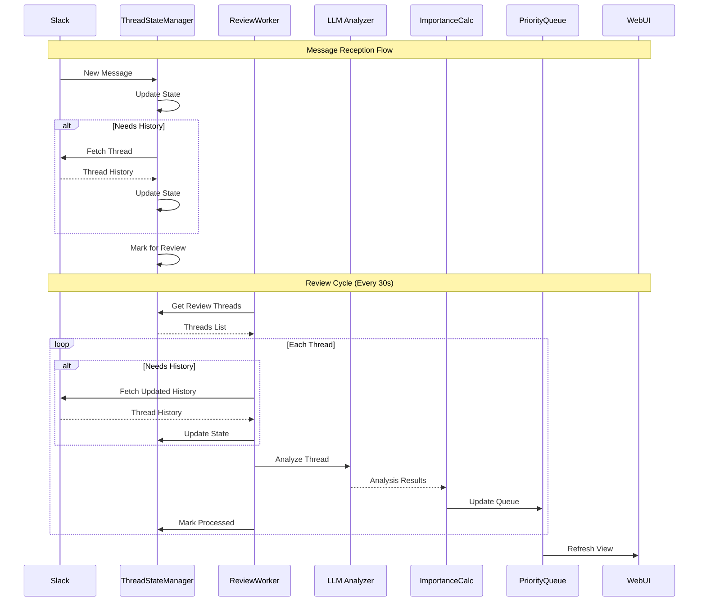
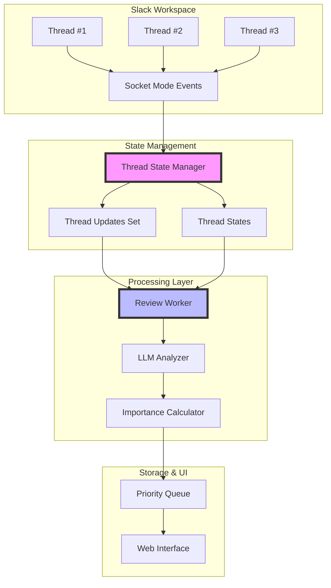
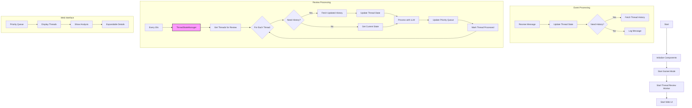

# Push-Based Slack Bot Documentation

This document outlines the functionality of the push-based Slack bot that analyzes threads in real-time using Socket Mode.

## Package Documentation
- [Slack Package](../slack/docs/slack_client.md): Core messaging and formatting functionality
- [LLM Package](../llm/docs/thread_analyzer.md): Thread analysis and action identification

## Overview

The bot listens for real-time Slack events and analyzes threads where:
- The user is mentioned
- The user has replied
- The user is the thread owner

Providing:
- Periodic thread analysis (every 30 seconds)
- State-based message tracking
- Thread importance scoring
- Priority-based thread queue
- Real-time web UI visualization

## Architecture

### 1. Message Processing Flow
This sequence diagram shows how messages flow through the system, from reception to analysis:



### 2. Component Architecture
This diagram shows the system's main components and their relationships:



### 3. Detailed Processing Steps
This diagram breaks down the specific steps in each processing phase:



Each diagram provides a different perspective:
1. **Message Processing Flow**: Shows the temporal sequence of operations and interactions between components
2. **Component Architecture**: Illustrates the system's structure and component relationships
3. **Detailed Processing Steps**: Breaks down the specific steps within each processing phase

## State Management Architecture

### Components Overview

1. **Thread State Manager**
   - **Core Functions**:
     - Maintains thread states
     - Tracks message updates
     - Optimizes API calls
     - Manages periodic reviews

   - **State Tracking**:
     - Thread messages history
     - Parent message status
     - Last fetch/analysis times
     - Analysis results

   - **Update Management**:
     - New message integration
     - History fetching decisions
     - Thread review scheduling

2. **Review Worker**
   - **Periodic Processing**:
     - 30-second review cycles
     - Batch thread processing
     - State-based optimizations

   - **Processing Flow**:
     - Gets review-ready threads
     - Fetches needed updates
     - Triggers LLM analysis
     - Updates priority queue

3. **Thread States**
   - **Per-Thread Data**:
     - Message history
     - Analysis state
     - Importance scores
     - Temporal metrics

   - **Optimization Features**:
     - Smart history fetching
     - Message deduplication
     - Parent message tracking

### Processing Flows

1. **Message Reception**:
   ```python
   message -> ThreadStateManager.update_thread_state()
   -> check history needs
   -> update state
   -> mark for review
   ```

2. **Review Cycle**:
   ```python
   every 30s:
     threads = get_threads_for_review()
     for thread in threads:
       if needs_history:
         fetch_and_update()
       process_with_llm()
       update_priority_queue()
       mark_processed()
   ```

3. **State Transitions**:
   ```
   New Message -> Pending Review -> Processing -> Analyzed -> Ready for Next Update
   ```

### Benefits
- Optimized API usage
- Consistent thread tracking
- Efficient batch processing
- Clear state management
- Reduced redundant operations

## Implementation Details

### ThreadStateManager
The core state management component:
```python
class ThreadStateManager:
    """
    Manages thread states and optimizes processing.
    
    Features:
    - Thread state caching
    - Smart API usage
    - Periodic batch processing
    - Message truncation
    - Worker-based processing
    """
```

### Thread State
Per-thread information:
```python
@dataclass
class ThreadState:
    thread_id: str              # thread_ts
    channel_id: str            # Slack channel ID
    messages: List[Dict]       # All known messages
    last_fetch_time: float     # Last time thread history was fetched
    last_analysis_time: float  # Last time thread was analyzed
    last_message_time: float   # Timestamp of most recent message
    needs_history_fetch: bool  # Whether thread history needs to be fetched
    is_parent_message_seen: bool  # Whether we've seen the parent message
    analysis_state: Optional[ThreadAnalysisState] = None
```

## Components Used

The bot uses several components:
- `ThreadStateManager`: State and processing management
- `SlackClientPushImpl`: Slack communication
- `ThreadAnalyzer`: LLM-based analysis
- `ImportanceCalculator`: Score calculation
- `ThreadPriorityQueue`: Thread prioritization
- `WebUI`: Real-time visualization

## Usage

Run the bot with:
```bash
python push_based_bot.py
```

The bot will:
1. Initialize all components
2. Start the review worker
3. Launch the web UI
4. Begin processing events

## Environment Variables
Required environment variables:
- `SLACK_BOT_TOKEN`: Bot token for event handling
- `SLACK_USER_TOKEN`: User token for data access
- `SLACK_APP_TOKEN`: App token for Socket Mode
- `SLACK_USER_ID`: ID of the user to track mentions for
- `GEMINI_API_KEY`: API key for Gemini LLM

## Key Differences from Pull-Based Bot

1. **Event Handling**:
   - Push: Real-time via Socket Mode with state management
   - Pull: Periodic polling

2. **Processing Model**:
   - Push: State-based with periodic reviews
   - Pull: Direct processing on poll

3. **Thread Tracking**:
   - Push: Comprehensive (mentions, replies, owned threads)
   - Pull: Mention-based only

4. **Analysis Timing**:
   - Push: Periodic batch processing
   - Pull: Immediate on poll

5. **UI Integration**:
   - Push: Real-time web interface
   - Pull: Console output only 