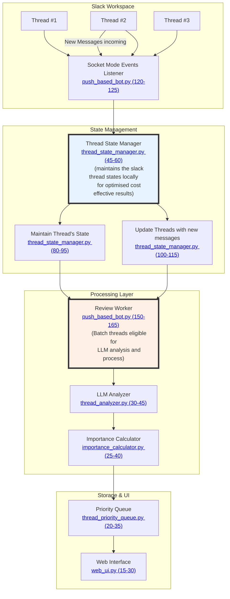
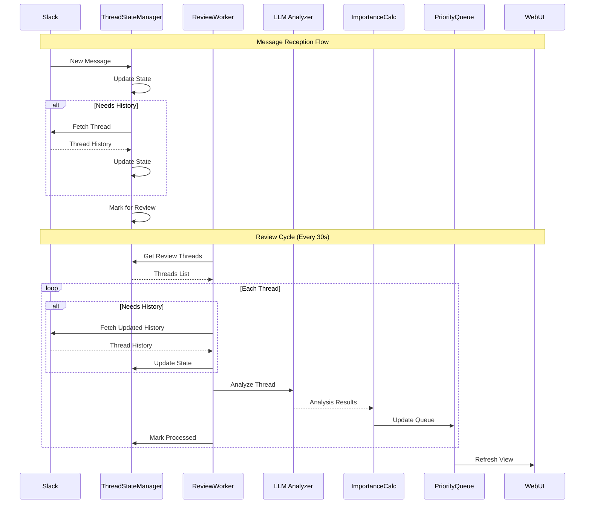
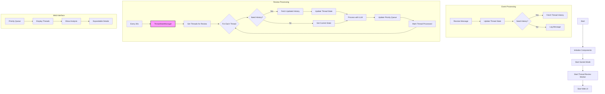
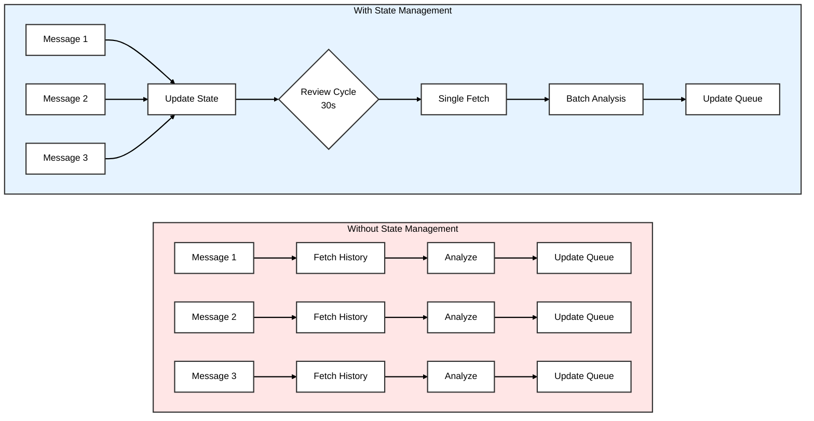

# Push-Based Slack Bot Documentation

This document outlines the functionality of the push-based Slack bot that analyzes slack threads in real-time using Socket Mode which uses Slack's Boult format.

## Problem Statement

A busy user on slack can attes how annoying and overwheling it gets to constantly recieve slack message alerts all day long and the timeless efforts it takes to go through these upcoming stream of events, manually seeking prioritisation of one over the other. This project aims to automate the prioritisation of these threads on behalf of the user, allocating an importance score to each of the slack thread based on content, activitiy and temporal importance of thread, employing LLM in the background.

## Overview

The bot listens for real-time Slack events and analyzes threads where:
- The user is mentioned
- The user has replied
- The user is the thread owner

Providing:
- Periodic thread analysis (every 30 seconds)
- Thread importance scoring
- Priority-based thread queue
- Real-time web UI visualization

## Package Documentation
- [Slack Package](../slack/docs/slack_client.md): Core messaging and formatting functionality
- [LLM Package](../llm/docs/thread_analyzer.md): Thread analysis and action identification


## Architecture

### 1. Component Architecture
This diagram shows the system's main components and their relationships:



### 2. Message Processing Flow
This sequence diagram shows how messages flow through the system, from reception to analysis:



### 3. Detailed Processing Steps
This diagram breaks down the specific steps in each processing phase:



Each diagram provides a different perspective:
1. **Message Processing Flow**: Shows the temporal sequence of operations and interactions between components
2. **Component Architecture**: Illustrates the system's structure and component relationships
3. **Detailed Processing Steps**: Breaks down the specific steps within each processing phase

## The Need for Thread State Management

### Problem Statement

Without dedicated state management, the bot faces several challenges in real-time thread processing:

1. **Redundant API Calls**
   - Every new message triggers a full thread history fetch
   - No tracking of what's already been fetched
   - Unnecessary load on Slack API
   - Example: In a high-activity thread with 10 messages/minute, that's 10 redundant API calls fetching the same history

2. **Inefficient LLM Usage**
   - Each message triggers immediate LLM analysis
   - No batching of messages for analysis
   - Higher costs due to frequent LLM API calls
   - Example: A burst of 5 messages in 10 seconds triggers 5 separate LLM analyses instead of one batch analysis

3. **Memory and Processing Overhead**
   - No message deduplication
   - Repeated processing of unchanged threads
   - Growing memory usage with duplicate message storage
   - Example: A thread with 100 messages gets stored multiple times, once per update

### Basic vs Optimized Approach



The comparison highlights key differences:

1. **Without State Management**
   - Each message triggers independent processing
   - Redundant API calls and analysis
   - Higher costs and resource usage
   - No message batching

2. **With State Management**
   - Messages update local state
   - Batch processing every 30 seconds
   - Single API call for updates
   - One analysis for multiple messages
   - Efficient resource utilization

For detailed implementation of the ThreadStateManager, including data structures, operations, and integration guide, see [Thread State Manager Documentation](thread_state_manager.md).

## Components Used

The bot uses several components:
- `ThreadStateManager`: State and processing management
- `SlackClientPushImpl`: Slack communication
- `ThreadAnalyzer`: LLM-based analysis
- `ImportanceCalculator`: Score calculation
- `ThreadPriorityQueue`: Thread prioritization
- `WebUI`: Real-time visualization

## Usage

Run the bot with:
```bash
python push_based_bot.py
```

The bot will:
1. Initialize all components
2. Start the review worker
3. Launch the web UI
4. Begin processing events

## Environment Variables
Required environment variables:
- `SLACK_BOT_TOKEN`: Bot token for event handling
- `SLACK_USER_TOKEN`: User token for data access
- `SLACK_APP_TOKEN`: App token for Socket Mode
- `SLACK_USER_ID`: ID of the user to track mentions for
- `GEMINI_API_KEY`: API key for Gemini LLM

## Key Differences from Pull-Based Bot

1. **Event Handling**:
   - Push: Real-time via Socket Mode with state management
   - Pull: Periodic polling

2. **Processing Model**:
   - Push: State-based with periodic reviews
   - Pull: Direct processing on poll

3. **Thread Tracking**:
   - Push: Comprehensive (mentions, replies, owned threads)
   - Pull: Mention-based only

4. **Analysis Timing**:
   - Push: Periodic batch processing
   - Pull: Immediate on poll

5. **UI Integration**:
   - Push: Real-time web interface
   - Pull: Console output only 