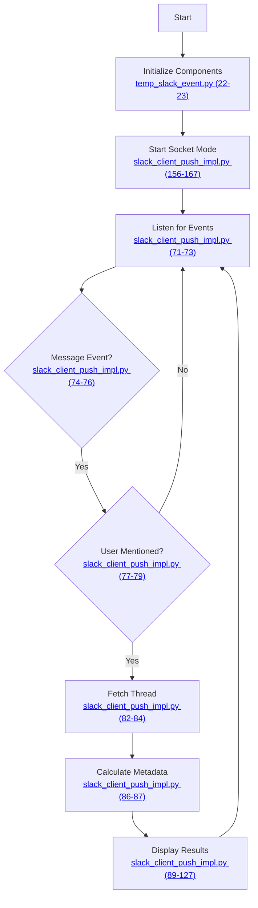

# Push-Based Slack Bot Documentation

This document outlines the functionality of the push-based Slack bot that analyzes threads in real-time using Socket Mode.

## Package Documentation
- [Slack Package](../slack/docs/slack_client.md): Core messaging and formatting functionality
- [LLM Package](../llm/docs/thread_analyzer.md): Thread analysis and action identification

## Overview

The bot listens for real-time Slack events and analyzes threads where the user is mentioned, providing:
- Immediate thread analysis
- Real-time message tracking
- Thread statistics and activity metrics
- Channel membership awareness
- Separate handling for global vs. specific mentions

## Flow Diagram



## Implementation Details

This section provides details about each step in the flow diagram. Click the links in the nodes above to view the specific code implementations.

### Initialize Components
Sets up the two-app architecture:
- Bot app for Socket Mode events
- User app for thread fetching
- Initializes group memberships

### Start Socket Mode
Establishes WebSocket connection:
- Uses app token for Socket Mode
- Sets up event handlers
- Starts listening for events

### Listen for Events
Continuously monitors for Slack events:
- Message events
- Thread updates
- Channel events

### Message Event Processing
Handles incoming messages:
- Checks for user mentions
- Differentiates between mention types:
  - Direct mentions (@user)
  - Group mentions (@team)
  - Global mentions (@here, @channel)
- Considers channel membership for global mentions

### Thread Analysis
For relevant messages:
- Fetches complete thread history
- Calculates comprehensive metadata:
  - Activity volume score
  - Recency score
  - Participation score
  - Direct/Group mention scores
  - Channel membership status

### Display Results
Shows real-time analysis:
1. Thread header with channel info
2. All messages in thread
3. User information
4. Reactions
5. Detailed thread statistics

## Components Used

The bot uses several components from the [Slack package](../slack/docs/slack_client.md):
- `SlackClientFactory`: Creates Slack client instance
- `ISlackClient`: Interface (implemented by `SlackPushClient`)
- Two Bolt apps:
  - Bot app for events
  - User app for data access

For detailed documentation of the Slack components, see the [Slack Package Documentation](../slack/docs/slack_client.md#package-components).

## Token Management

The bot uses a hybrid token approach:
- **Bot Token (`SLACK_BOT_TOKEN`)**:
  - Real-time event reception
  - Limited to joined channels
  - Used by bot app

- **User Token (`SLACK_USER_TOKEN`)**:
  - Thread fetching
  - Channel access
  - Used by user app

- **App Token (`SLACK_APP_TOKEN`)**:
  - Socket Mode connection
  - WebSocket authentication

## Usage

Run the bot with:
```bash
python temp_slack_event.py
```

The bot will:
1. Initialize both Bolt apps
2. Start Socket Mode connection
3. Begin processing events in real-time

## Output Format
```
==================================================
Thread in #channel-name (Member)

Messages:
[2024-03-21 10:30:15] John Doe: Hey @team, can we discuss this?
Reactions: :thumbsup: x2 | :eyes: x1

Thread Stats:
• Channel Status:
  - Membership: Member
• Basic Metrics:
  - Messages: 5
  - Participants: 3
  - Reactions: 2
• Activity Scores:
  - Volume: 0.43
  - Recency: 0.95
  - Participation: 0.10
• Mention Metrics:
  - Direct: 1 (score: 0.20)
  - Group: 2 (score: 0.13)
• Time Since Last Reply: 0.5 hours
==================================================
```

## Environment Variables
Required environment variables:
- `SLACK_BOT_TOKEN`: Bot token for event handling
- `SLACK_USER_TOKEN`: User token for data access
- `SLACK_APP_TOKEN`: App token for Socket Mode
- `SLACK_USER_ID`: ID of the user to track mentions for

## Key Differences from Pull-Based Bot

1. **Event Handling**:
   - Push: Real-time via Socket Mode
   - Pull: Periodic polling

2. **Token Usage**:
   - Push: Uses both bot and user tokens
   - Pull: Uses single user token

3. **Channel Access**:
   - Push: Real-time membership checks
   - Pull: Uses cached memberships

4. **Performance**:
   - Push: Lower API usage, real-time
   - Pull: Higher API usage, batched

5. **Setup**:
   - Push: Requires Socket Mode configuration
   - Pull: Simpler setup with single token 