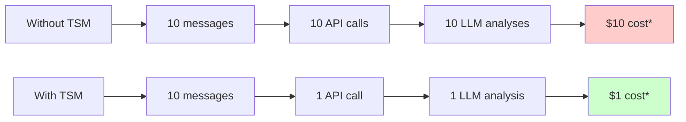
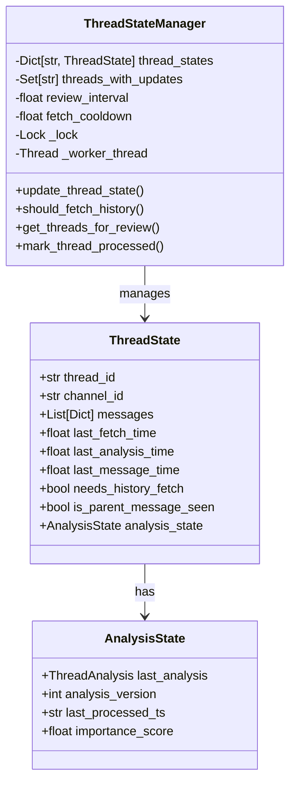
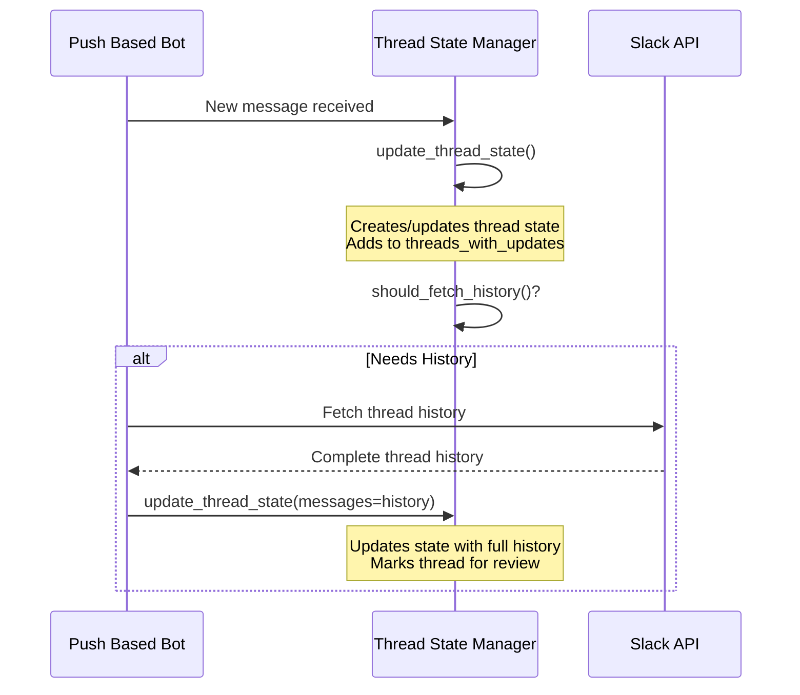
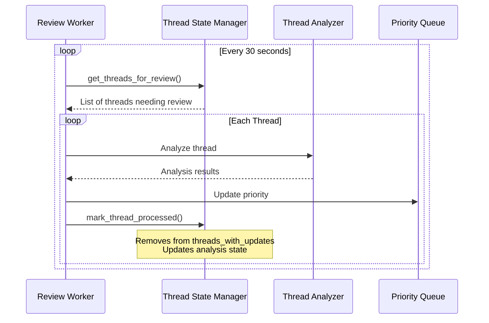

# Thread State Manager

## Why Thread State Manager?

The Thread State Manager addresses several critical challenges in real-time Slack thread processing:

### 1. Real-time Processing Challenges
Without a state manager, real-time thread processing faces these issues:
- Every new slack event is independent of its predecesors even when belonging to an existing thread. This would require us to trigger immediate API calls to fetch slack history for the entire thread.
- Each event would require separate LLM analysis
- Thread context is fetched repeatedly
- High costs for API and LLM usage
- Performance degradation in high-traffic channels

### 2. Cost & Resource Optimization
The state manager provides significant savings:


### 3. Smart Caching Benefits
- **API Efficiency**: Reduces Slack API calls by up to 90%
- **LLM Cost Reduction**: Batches messages for single analysis
- **Memory Optimization**: Deduplicates messages and maintains clean state
- **Context Preservation**: Maintains thread history and parent messages

### 4. Real-world Impact
Example scenarios showing TSM benefits:

1. **High-frequency Thread**
   - Without TSM: 100 API calls, 100 analyses per hour
   - With TSM: ~12 API calls, ~2 analyses per hour
   - Result: 88% reduction in API usage, 98% reduction in LLM costs

2. **Multiple Active Threads**
   - Without TSM: Each thread processed independently
   - With TSM: Batch processing across threads
   - Result: Linear scaling with thread count

3. **Long-running Threads**
   - Without TSM: Context lost between updates
   - With TSM: Persistent thread state
   - Result: Better analysis quality and context awareness

This document provides a detailed explanation of the ThreadStateManager component, which optimizes thread processing and state management in the Slack bot.

## Core Data Structures



## How It Works: A Real-world Flow

### 1. Message Reception Flow


1. **New Message Arrives**
   - Bot receives Slack event
   - Calls `update_thread_state` with new message
   - ThreadStateManager either:
     - Creates new thread state, or
     - Updates existing thread state
   - Thread is marked for review in `threads_with_updates`

2. **History Check**
   - Bot checks `should_fetch_history`
   - Returns true if:
     - Thread is new
     - Parent message missing
     - History fetch needed
   - If true, bot:
     - Fetches complete thread history
     - Updates state with full history

### 2. Review and Analysis Flow


1. **Review Cycle** (<a href='../push_based_bot.py'>review_threads in push_based_bot.py</a>)
   - Every 30 seconds, bot's review worker:
     - Calls <a href='../thread_state_manager.py'>get_threads_for_review</a> to get pending threads
     - Gets threads from `threads_with_updates` set
     - Only returns threads updated within review interval

2. **Thread Processing** (<a href='../push_based_bot.py'>process_thread_analysis in push_based_bot.py</a>)
   - For each thread:
     - Performs LLM analysis
     - Calculates importance
     - Updates priority queue
     - Calls <a href='../thread_state_manager.py'>mark_thread_processed</a>

3. **State Updates** 
   - `mark_thread_processed`:
     - Removes thread from `threads_with_updates`
     - Updates analysis state
     - Increments analysis version
     - Records importance score

### 3. State Management Details

1. **Thread State Lifecycle**
   - New Message: Creates initial state, marks for history fetch
   - History Fetch: Updates with complete thread history
   - Analysis: Adds analysis results and importance score

2. **Update Types**
   - Single Message: Adds to existing thread state
   - Full History: Updates entire thread history
   - Analysis: Updates thread importance and version

## Key Benefits

1. **API Efficiency**
   - Reduces API calls by batching requests
   - Example: 10 messages → 1 API call instead of 10

2. **LLM Cost Reduction**
   - Batches messages for single analysis
   - Example: 5 messages → 1 analysis instead of 5

3. **Memory Optimization**
   - Maintains single copy of thread history
   - Prevents duplicate messages
   - Cleans up old thread states

## Simple Integration Example

```python
# Initialize
state_manager = ThreadStateManager(review_interval=30.0)

# When new message arrives
def on_message(message):
    # Update state and check if history needed
    if state_manager.should_fetch_history(message.channel, message.thread_ts):
        history = fetch_thread_history()
        state_manager.update_thread_state(messages=history)
    else:
        state_manager.update_thread_state(new_message=message)

# Review cycle (runs every 30s)
def review():
    for thread in state_manager.get_threads_for_review():
        analyze_and_prioritize(thread)
        state_manager.mark_thread_processed(thread)
``` 