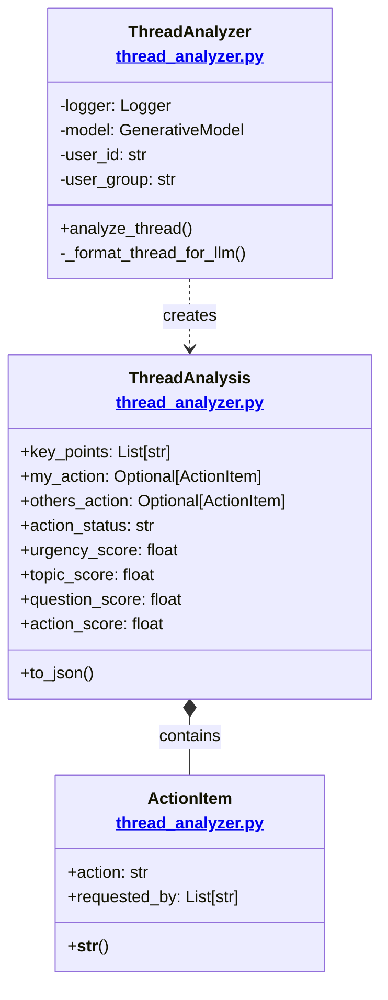

# LLM Package Documentation

This package provides LLM-based analysis capabilities for Slack threads, using Google's Gemini model to extract insights and identify action items.

## Architecture Overview



## Components

### ThreadAnalyzer
Main class that handles thread analysis using Gemini LLM.

#### Key Methods
- `analyze_thread(thread_messages: List[Dict]) -> ThreadAnalysis`:
  - Analyzes a thread using LLM
  - Extracts key points and action items
  - Identifies who needs to take action
  - Determines thread status
  - Calculates content-based scores

- `_format_thread_for_llm(thread_messages: List[Dict]) -> str`:
  - Formats thread messages for LLM input
  - Preserves timestamps and user mentions
  - Maintains chronological order
  - Format: `[YYYY-MM-DD HH:MM:SS] <@user>: message`

### ThreadAnalysis
Data class that holds the analysis results.

#### Fields
- `key_points`: List of main discussion points
- `my_action`: Action required from the user (if any)
- `others_action`: Action required from other users (if any)
- `action_status`: Current status of the thread

#### Content-Based Scores (0.0-1.0)
- `urgency_score`: Time sensitivity of the thread
  - 1.0: Immediate action needed (e.g., "urgent", "ASAP")
  - 0.7: Soon but not immediate (e.g., "by tomorrow")
  - 0.4: Normal timing (e.g., "when you can")
  - 0.1: No time pressure

- `topic_score`: Importance of the subject matter
  - 1.0: Critical (e.g., production, security)
  - 0.7: Important (e.g., features, bugs)
  - 0.4: Normal (e.g., updates, discussions)
  - 0.1: Low priority (e.g., minor issues)

- `question_score`: Question density
  - 1.0: Multiple urgent questions
  - 0.7: Several questions
  - 0.4: One or two questions
  - 0.0: No questions

- `action_score`: Required work/effort
  - 1.0: Major work required
  - 0.7: Significant tasks
  - 0.4: Minor tasks
  - 0.0: No action needed

### ActionItem
Data class representing an action item with its requestor.

#### Fields
- `action`: Description of the action needed
- `requested_by`: List of users who requested this action

## LLM Integration

The package uses Google's Gemini model for analysis:
```python
genai.configure(
    api_key=api_key,
    transport="rest",
    client_options={"api_endpoint": "https://public-api.grabgpt.managed.catwalk-k8s.stg-myteksi.com/google"}
)
model = genai.GenerativeModel('gemini-2.5-flash')
```

### Prompt Structure
The LLM prompt is structured to extract:
1. Key discussion points (3-5 bullet points)
2. Actions required from specific users
3. Actions required from others
4. Overall thread status
5. Content-based scores for urgency, topic importance, questions, and actions

Example prompt response format:
```
[Key Points]
• point 1
• point 2
• point 3

[My Actions]
• action: <action description>
• requested_by: <@user1>, <@user2>

[Others Actions]
• action: <action description>
• requested_by: <@user1>, <@user2>

[Status]
• "Action required: <brief description>" OR
• "No action required" OR
• "Waiting on others: <brief description>"

[Scores]
• urgency: <0.0-1.0>
• topic: <0.0-1.0>
• question: <0.0-1.0>
• action: <0.0-1.0>
```

## Integration with Slack Clients

The ThreadAnalyzer is integrated into both pull-based and push-based Slack clients:

### Pull-Based Integration
```python
class SlackPullClient(ISlackClient):
    def __init__(self, user_id: str = None):
        self.analyzer = ThreadAnalyzer()  # LLM-based thread analyzer
```

### Push-Based Integration
The push-based client can use the analyzer to process real-time messages and determine their importance.

## Usage

```python
from llm.thread_analyzer import ThreadAnalyzer

# Initialize analyzer
analyzer = ThreadAnalyzer()

# Analyze a thread
analysis = analyzer.analyze_thread(thread_messages)

# Access results
print("Key Points:", analysis.key_points)
if analysis.my_action:
    print("Your Action:", analysis.my_action)
if analysis.others_action:
    print("Others' Action:", analysis.others_action)
print("Status:", analysis.action_status)

# Access content-based scores
print("Urgency Score:", analysis.urgency_score)
print("Topic Score:", analysis.topic_score)
print("Question Score:", analysis.question_score)
print("Action Score:", analysis.action_score)

# Get JSON representation
json_data = analysis.to_json(indent=2)
```

## Environment Variables
- `GEMINI_API_KEY`: API key for Google's Gemini model
- `SLACK_USER_ID`: ID of the user for action identification
- `SLACK_USER_GROUP`: (Optional) User's group ID for action identification 