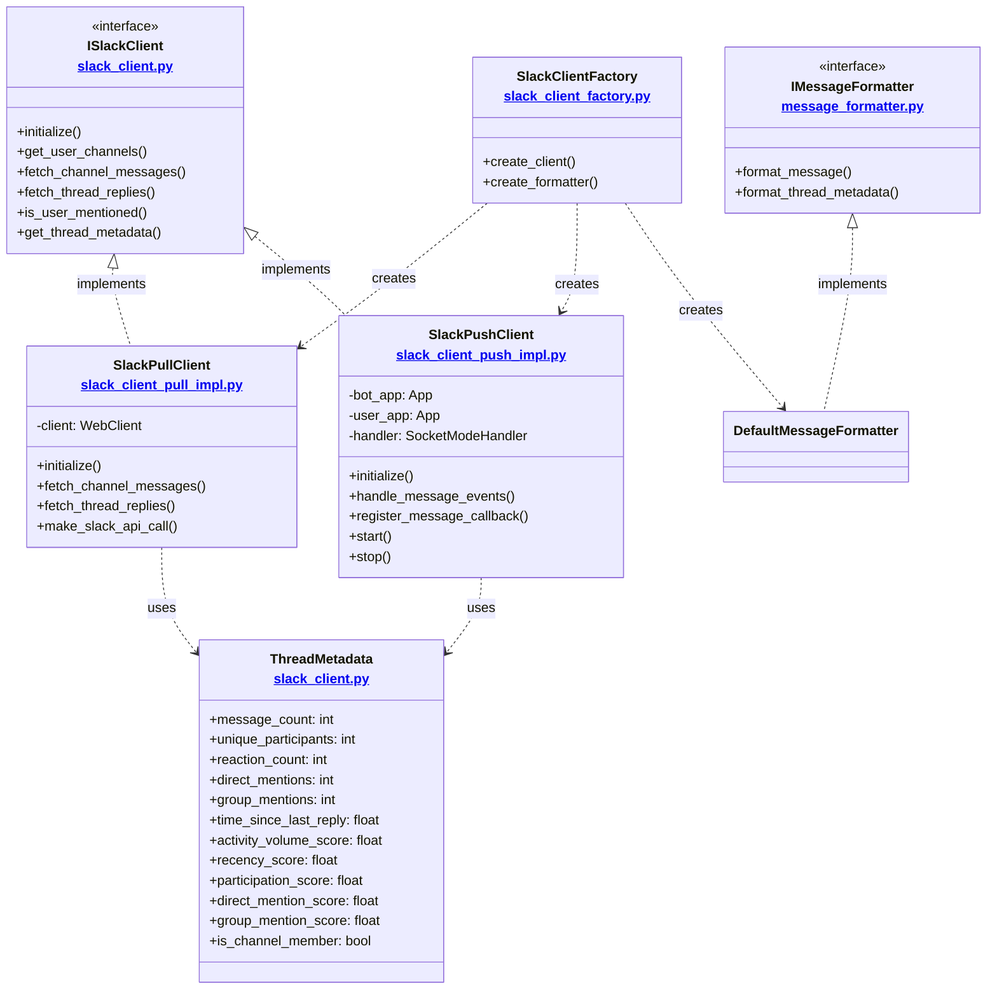

# Slack Package Documentation

This package provides a modular interface for interacting with Slack, handling message formatting, and managing client implementations. It supports both pull-based (polling) and push-based (Socket Mode) implementations.

## Implementation Approaches

### Pull-Based Implementation
- Uses active polling to fetch messages
- Single WebClient with `SLACK_USER_TOKEN`
- Manual rate limit handling
- Simpler architecture but higher latency
- Whitelist-based channel access

### Push-Based Implementation (Socket Mode)
- Real-time event streaming via Socket Mode
- Two-token strategy:
  * Bot App (`SLACK_BOT_TOKEN`): Handles real-time events
  * User App (`SLACK_USER_TOKEN`): Thread fetching and analysis
- Built-in rate limiting via Bolt framework
- Lower latency, event-driven architecture
- Dynamic channel access
- Callback-based event handling

## Thread Metadata and Scoring

The package includes a comprehensive thread analysis system that calculates various metrics:

### Activity Metrics
- **Activity Volume Score** (0-1): `min(1, log(message_count+1)/(log(max_expected_message+1)))`
  - Normalized logarithmic scale
  - `max_expected_message = 200`
  - Accounts for thread size while preventing large threads from dominating

- **Recency Score** (0-1): `e^(decay_factor * minutes_since_last_msg)`
  - Exponential decay function
  - `decay_factor = -0.04`
  - Prioritizes recently active threads

- **Participation Score** (0-1): `min(1, unique_participants/max_participants)`
  - Linear normalization
  - `max_participants = 30`
  - Rewards diverse participation

### Mention Metrics
- **Direct Mention Score** (0-1): `min(1, direct_mentions/max_direct_mentions)`
  - `max_direct_mentions = 5`
  - Tracks personal (@user) mentions

- **Group Mention Score** (0-1): `min(1, group_mentions/max_group_mentions)`
  - `max_group_mentions = 15`
  - Tracks team/group (@team) mentions

### Channel Status
- **Channel Membership**: Boolean indicating if user is member of the thread's channel
  - Affects how global mentions (@here, @channel) are processed
  - Used for access control and mention relevance

## Architecture Overview



## Token Management and Rate Limiting

### Pull-Based Client
- Uses `SLACK_USER_TOKEN`
- Full access to public channels without joining
- Manual rate limit handling:
  * Retries with delay on rate limit errors
  * Basic error handling and backoff
  * Custom retry mechanism

### Push-Based Client (Two-App Approach)
- **Bot App**
  - Uses `SLACK_BOT_TOKEN` and `SLACK_APP_TOKEN`
  - Handles real-time events via Socket Mode
  - Limited to channels where bot is member
  - Built-in rate limiting via Bolt framework:
    * Automatic retries with exponential backoff
    * Queue management for concurrent requests
    * Rate limit awareness across calls
  
- **User App**
  - Uses `SLACK_USER_TOKEN`
  - Handles thread fetching and analysis
  - Full access to public channels
  - Benefits from Bolt's rate limit handling

## Event Handling

### Pull-Based Client
- Active polling of channels
- Timestamp tracking for new messages
- Higher latency but predictable
- Resource usage proportional to polling frequency

### Push-Based Client
- Real-time event reception via Socket Mode
- Event callback registration:
  ```python
  client.register_message_callback(callback_function)
  ```
- Lower latency, event-driven resource usage
- Automatic reconnection handling

## Environment Variables
- `SLACK_USER_TOKEN`: Slack user token for API access
- `SLACK_BOT_TOKEN`: Slack bot token (for push-based client)
- `SLACK_APP_TOKEN`: Slack app-level token (for Socket Mode)
- `SLACK_USER_ID`: ID of the user to track mentions for

## Usage

The package is designed to be used through the factory pattern:

```python
from slack.slack_client_factory import SlackClientFactory

# Create a pull-based client (polling)
client = SlackClientFactory.create_client("pull")

# Create a push-based client (Socket Mode)
client = SlackClientFactory.create_client("push")

# For push-based client, register callbacks
def on_message(channel_id, message):
    print(f"New message in {channel_id}: {message}")
    
client.register_message_callback(on_message)

# Start the Socket Mode handler (push-based only)
client.start()

# Create a formatter
formatter = SlackClientFactory.create_formatter()
```

## Output Format

Thread analysis output includes:

```
==================================================
Thread in #channel-name (Member)

Messages:
[2024-03-21 10:30:15] John Doe: Hey @team, can we discuss this?
Reactions: :thumbsup: x2 | :eyes: x1

Thread Stats:
• Channel Status:
  - Membership: Member
• Basic Metrics:
  - Messages: 5
  - Participants: 3
  - Reactions: 2
• Activity Scores:
  - Volume: 0.43
  - Recency: 0.95
  - Participation: 0.10
• Mention Metrics:
  - Direct: 1 (score: 0.20)
  - Group: 2 (score: 0.13)
• Time Since Last Reply: 0.5 hours
==================================================
``` 