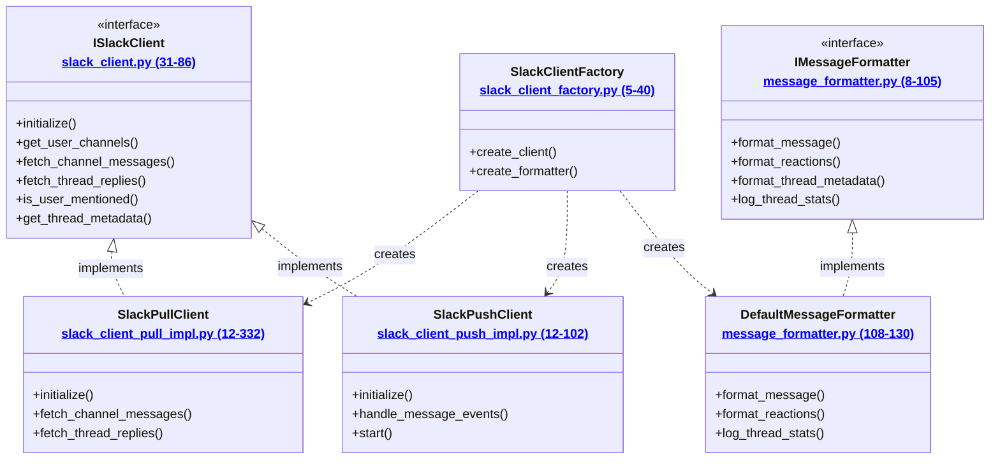

# Slack Package Documentation

This package provides a modular interface for interacting with Slack, handling message formatting, and managing client implementations.

## Architecture Overview



## Package Components

### Core Interfaces

#### [`ISlackClient`](../slack_client.py)
Interface defining all Slack operations. See [interface documentation](slack_client.md) for details.

#### [`IMessageFormatter`](../message_formatter.py)
Interface for message formatting operations. See [formatter documentation](message_formatter.md) for details.

### Implementations

#### [`SlackPullClient`](../slack_client_pull_impl.py)
Pull-based implementation using Slack's Web API. See [pull client documentation](slack_client_pull_impl.md) for details.

#### [`SlackPushClient`](../slack_client_push_impl.py)
Push-based implementation using Slack's Socket Mode. See [push client documentation](slack_client_push_impl.md) for details.

#### [`DefaultMessageFormatter`](../message_formatter.py)
Default implementation of message formatting. See [formatter documentation](message_formatter.md) for details.

### Factory

#### [`SlackClientFactory`](../slack_client_factory.py)
Factory for creating appropriate client and formatter instances. See [factory documentation](slack_client_factory.md) for details.

## Usage

The package is designed to be used through the factory pattern:

```python
from slack.slack_client_factory import SlackClientFactory

# Create a pull-based client
client = SlackClientFactory.create_client("pull")

# Create a formatter
formatter = SlackClientFactory.create_formatter(logger)
```

## Environment Variables
- `SLACK_USER_TOKEN`: Slack user token for API access
- `SLACK_BOT_TOKEN`: Slack bot token (for push-based client)
- `SLACK_SIGNING_SECRET`: Slack signing secret (for push-based client)
- `SLACK_APP_TOKEN`: Slack app-level token (for Socket Mode)
- `SLACK_USER_ID`: ID of the user to track mentions for 